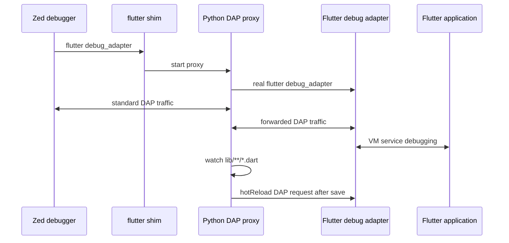

# Flutter debugging with hot reload on save in Zed

This configuration keeps Flutter breakpoint support in Zed and adds automatic hot reload whenever a Dart file under `lib/` is saved.

## Why a workaround is needed

Zed launches Flutter through the Dart extension and Flutter's Debug Adapter Protocol (DAP) server:

```text
Zed -> flutter debug_adapter -> flutter run --machine -> application
```

Flutter's `--pid-file`/`SIGUSR1` hot-reload mechanism is intended for an interactive `flutter run` process. In DAP mode, hot reload is instead performed by sending the custom `hotReload` DAP request. As a result:

- `--pid-file` is not created reliably in a Zed debug session.
- A PID-based `fswatch` task cannot provide hot reload while retaining Zed breakpoints.
- Zed does not currently expose Flutter's custom `hotReload` request as an action or on-save hook.

The Dart extension also receives Zed's user-provided adapter path but currently ignores it in `get_dap_binary`, so a normal `dap.Dart.binary` override does not work for this extension-provided adapter.

## Architecture



The proxy forwards normal debugger traffic unchanged, so breakpoints, stepping, variables, exceptions, the debug console, and hot restart continue to use Flutter's official adapter.

## Files

- `flutter_dap_hot_reload_proxy.py` — forwards DAP messages, watches Dart files, and injects `hotReload` requests.
- `dap-bin/flutter` — intercepts only `flutter debug_adapter`; all other Flutter commands are delegated to the real Flutter executable.
- `debug.json` — puts `dap-bin` before the real Flutter SDK in the debug adapter's `PATH`.

## Requirements

- Zed with the Dart extension installed.
- Flutter available on `PATH`.
- Python 3.10 or newer.
- [`fswatch`](https://emcrisostomo.github.io/fswatch/) available on `PATH`.
- macOS or Linux. The included `flutter` shim is a POSIX shell script.

Install `fswatch` on macOS with:

```sh
brew install fswatch
```

On Debian/Ubuntu systems where it is packaged:

```sh
sudo apt install fswatch
```

Make both helpers executable:

```sh
chmod +x ~/.config/zed/dap-bin/flutter
chmod +x ~/.config/zed/flutter_dap_hot_reload_proxy.py
```

## Debug configuration

Each Flutter launch entry must put the shim before the real Flutter executable:

```jsonc
{
  "label": "Debug flutter app",
  "adapter": "Dart",
  "type": "flutter",
  "cwd": "$ZED_WORKTREE_ROOT",
  "request": "launch",
  "program": "lib/main.dart",
  "env": {
    "PATH": "/absolute/path/to/zed-config/dap-bin:/absolute/path/to/flutter/bin:/opt/homebrew/bin:/usr/local/bin:/usr/bin:/bin"
  }
}
```

Important details:

1. `dap-bin` must be the first directory.
2. The directory containing the real `flutter` executable must occur later.
3. Do not add `--pid-file`; the proxy uses DAP, not Unix signals.
4. `ZED_REAL_FLUTTER` is optional. If supplied, it must point to the real Flutter executable. Otherwise, the shim searches the remaining `PATH` entries.

For FVM, put the selected Flutter SDK's `bin` directory after `dap-bin`, or set `ZED_REAL_FLUTTER` explicitly:

```jsonc
"env": {
  "PATH": "/absolute/path/to/zed-config/dap-bin:/absolute/path/to/fvm/flutter_sdk/bin:/usr/local/bin:/usr/bin:/bin",
  "ZED_REAL_FLUTTER": "/absolute/path/to/fvm/flutter_sdk/bin/flutter"
}
```

## Usage

1. Open the Flutter project root in Zed.
2. Stop any debug session started before this configuration was loaded.
3. Run `debugger: start`; this config maps that action to `space d s` in Vim normal mode.
4. Select `Debug flutter app`.
5. Set and use breakpoints normally.
6. Save a `.dart` file under `lib/` to request a hot reload.

The watcher starts only for configurations whose `type` is `flutter`, and only after a DAP `launch` request. Ordinary Dart debug sessions are forwarded without starting the watcher.

## Verification and logs

The proxy logs to:

```text
/tmp/zed-flutter-dap-proxy.log
```

After the app starts, the log should contain:

```text
proxy started (pid ...)
watching /path/to/project/lib
Flutter app started; hot reload enabled
```

After saving a Dart file:

```text
requesting hot reload
hot reload completed
```

Verify which adapter Zed launched on macOS/Linux:

```sh
ps ax -o pid=,ppid=,command= | grep -E 'flutter_dap_hot_reload_proxy|flutter_tools.snapshot debug_adapter' | grep -v grep
```

A working session should show `flutter_dap_hot_reload_proxy.py` as well as the real Flutter debug adapter below it.

## Sharing between systems

### Recommended: dotfiles repository plus a per-machine generated `PATH`

Commit these portable files:

```text
FLUTTER_DEBUG_HOT_RELOAD.md
flutter_dap_hot_reload_proxy.py
dap-bin/flutter
```

The shim now discovers its own location, follows symlinks, and locates the real Flutter executable from the remaining `PATH`, so it contains no username or Flutter installation path.

The `env.PATH` value in `debug.json` is inherently machine-specific because Zed's Dart extension must resolve the shim instead of the real `flutter` executable. Generate or template that value on each machine using a dotfile manager such as chezmoi, yadm, or a bootstrap script.

Values that commonly vary by system:

- Zed config directory:
  - macOS/Linux dotfiles convention: `~/.config/zed`
  - Zed's standard macOS application-support location may instead be `~/Library/Application Support/Zed`
- Flutter SDK directory.
- Home directory and username.
- Homebrew prefix (`/opt/homebrew` on Apple Silicon, often `/usr/local` on Intel).
- Flutter device IDs, especially iOS simulator UUIDs.

Keep device-specific launch profiles out of shared configuration, or generate them separately. A generic Flutter profile that lets Flutter select the active device is more portable.

### Symlink strategy

If `~/.local/bin` is already before the real Flutter SDK in the environment inherited by Zed, link the shim there:

```sh
mkdir -p ~/.local/bin
ln -s ~/.config/zed/dap-bin/flutter ~/.local/bin/flutter
```

The shim follows the symlink back to the Zed config directory. It delegates ordinary commands such as `flutter doctor` and `flutter pub get` to the real Flutter executable.

With this strategy, `debug.json` may not need a custom `env.PATH`, provided Zed actually inherits `~/.local/bin` before the Flutter SDK. Confirm with the process/log checks above.

Be aware that the symlink shadows `flutter` for all applications using that `PATH`, not only Zed. Ordinary Flutter commands are delegated, but other editors that directly launch `flutter debug_adapter` would also use the proxy.

### Project-local sharing

A team can copy the scripts into the repository, for example:

```text
.zed/tools/flutter_dap_hot_reload_proxy.py
.zed/tools/bin/flutter
.zed/debug.json
```

Then generate `.zed/debug.json` during project setup with absolute paths appropriate to that machine. Do not commit a teammate's home directory or Flutter SDK location.

A project bootstrap script can:

1. Find Flutter using `command -v flutter`.
2. Find Python using `command -v python3`.
3. Check `command -v fswatch`.
4. Mark the scripts executable.
5. Render the absolute shim and Flutter directories into `.zed/debug.json`.

### Windows

The Python DAP forwarding logic is portable, but this package is not ready to share with Windows unchanged because:

- `dap-bin/flutter` is a POSIX shell script.
- The watcher expects `fswatch`.
- Windows executable resolution uses `flutter.bat`.

A Windows package would need a `flutter.bat` or PowerShell shim and a portable file-watching backend.

## Troubleshooting

### The proxy log is not created

Zed launched the real Flutter adapter directly. Check that:

- The debug session was fully stopped and restarted after changing `debug.json`.
- `dap-bin` is first in the launch profile's `env.PATH`.
- `dap-bin/flutter` is executable.

### The log says the app started, but saves do nothing

Check that:

- The changed file is under the project's `lib/` directory.
- `fswatch` is installed and visible in the configured `PATH`.
- The file was written to disk, not only modified in an unsaved buffer.
- The log contains `requesting hot reload`.

### Breakpoints do not work

The proxy does not implement breakpoint behavior; it forwards it to Flutter's official adapter. Open Zed's debug adapter logs with `dev: open debug adapter logs` and verify that the real adapter started successfully.

### Multiple reloads after one save

`fswatch -o` coalesces events with a 200 ms latency, and Flutter's DAP request also enables debouncing. Format-on-save or code generators may still produce another filesystem event after the first batch.

## Maintenance

This workaround depends on Flutter's custom `hotReload` DAP request and `flutter.appStarted` event. Both are part of Flutter's current debug adapter implementation but are not standard DAP messages.

Re-test the integration after major Flutter, Dart extension, or Zed upgrades. The workaround can be retired if Zed adds a native Flutter hot-reload action/on-save setting or if the Dart extension begins honoring the user-provided adapter path.
